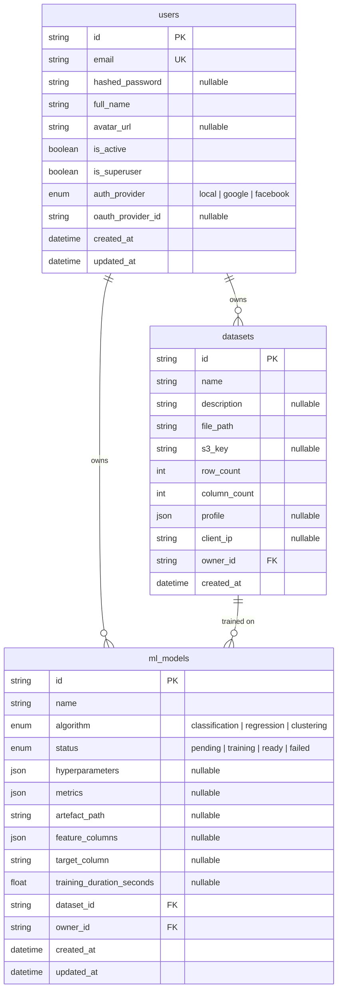

# Entity-Relationship Diagram

## Notes

| Table | Key Points |
|-------|-----------|
| `users` | Supports local credentials and OAuth (Google, Facebook). `hashed_password` is nullable for OAuth-only users. |
| `datasets` | `s3_key` is nullable — set when `S3_BUCKET_NAME` is configured, otherwise falls back to `file_path` on local disk. Max 5 datasets per user (oldest evicted on overflow). |
| `ml_models` | Belongs to both a `user` (owner) and a `dataset` (training source). Tracks algorithm type, training status, hyperparameters, and evaluation metrics. |
